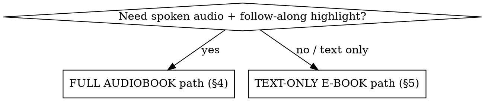

# Behold My Messenger — Create a New Book Site

Runbook for standing up a **new** book from a manuscript to a live page. This is the greenfield
counterpart to **audiobook-amend** (which changes an already-built book). Read §0–§2 before acting.

## 0. Pick your path FIRST

**The reader's gold-highlight sync is derived from the audio timeline** (`build_readalong.py` replays
`master.py`'s assembly to time each paragraph). So **follow-along highlight REQUIRES audio.** A
"text-only e-book" is a static large-type reader (text + figures + font controls + lightbox), no
audio, no timed highlight. Don't promise sync without audio.

## 1. Architecture & invariants (shared with audiobook-amend — see it for full detail)
- **Static site, no build step:** `index.html` (library hub) + `book-N.html` (one player per book).
  Audio on **Cloudflare R2**; read-along data is JSONP in `readalong/`. Served by **Cloudflare Pages from `main`**.
- **The audio SOURCE is the `.docx`** (`extract.py` parses it). **The PDF is only the bookmark + diagram
  reference** (`split_appendices.py`, `extract_diagrams.py`). Never extract narration text from the PDF.
- **Per-book selection = `BMM_BOOK` env var.** **Book 5 is FLAT** (`audio/book-5/`, `readalong/`,
  `audiobook/data/`); **every other book (1–4, and new 6+) NESTS** under `book-N/`. `config.py` derives
  all paths from `BMM_BOOK` — never hardcode them.
- **Two Python environments:** `.venv-tts` (GPU; torch + kokoro; 24 kHz) **only** for `render_kokoro.py`;
  `C:\Python314\python.exe` (base; pydub + static_ffmpeg + `audioop-lts`; 44.1 kHz) for everything else.
- **Voice cast = the `VOICE` map in `render_kokoro.py`** (Kokoro, the shipping voices). `config.py VOICES`
  is edge-tts, **dev preview only**. Roles assigned by structural cue, not name-mention.
- **`book-5.html` is the template** — `make_player.py` clones it for every other book and is refused for N=5.

## 2. SAFETY — non-negotiable
1. **Never type a secret / API key / token anywhere.** R2 auth is `wrangler login` (browser OAuth) — no key to paste.
2. **Never run the GPU render (`render_kokoro`) at the same time as ffmpeg (`master`/`split_appendices`/`build_readalong`) or heavy spawns (Workflows, big Grep sweeps, multiple agents).** On this Windows box that contention hard-kills ffmpeg (`0xC0000142`). Run renders ALONE; to wait, block with `TaskOutput(block=true)`. See memory [[render-contention]].
3. **Ship Kokoro audio ONLY.** edge-tts (`render.py`) is for dev previews — **not licensed for resale**. Never publish edge-tts mp3s.
4. **Deploy order: R2 FIRST, manifest SECOND.** Upload mp3s to R2 before pushing the manifest, so a user never gets a manifest pointing at missing audio.
5. **Cache-bust is automatic and must stay so:** `publish_audio` bumps `?v=` in `versions.json`; `_headers` makes HTML/manifests/read-along `must-revalidate` while R2 audio is 1-year `immutable`.
6. **mp3s are gitignored.** Never commit audio; R2 is the host. Commit only HTML, manifests, read-along, `audiobook/data`, scripts.
7. **Branding carries to every new page:** author names gold/silver (`.au-gold`/`.au-silver` on index, `.name-gold`/`.name-silver` on players); "CROWNED EAGLES GLOBAL" = `.ceg` rainbow wordmark (honour `prefers-reduced-motion`). **Never advertise the TTS engine** on customer-facing pages.

## 3. Prerequisites

**FIRST — STOP if the manuscript is missing.** A new book needs its `.docx` (and the PDF, for figures)
placed in `SRC` (set in `config.py`; currently `…\OneDrive\Desktop\5books26Dec`, which holds only
Books 1–5). If the new book's files aren't there, **STOP and ask the user to supply them** — do not
invent a path. Without them `config.py` has no `BOOKS` entry and `extract.py` cannot run.

| Need | For | What |
|------|-----|------|
| Base Python | both paths | `C:\Python314\python.exe` + `python-docx`, `pydub`, `static_ffmpeg`, `audioop-lts`, `PyMuPDF` (fitz), `Pillow` |
| GPU TTS venv | audiobook only | `.venv-tts` with CUDA `torch` + `kokoro` |
| wrangler | audiobook deploy | `npm i -g wrangler` then `wrangler login` (OAuth — no key) |
| Source manuscript | both | the book's `.docx` (audio/text source) |
| Source PDF | figures/bookmarks | the book's PDF (diagram extraction + long-track splitting only) |

## 4. FULL AUDIOBOOK path — create a new book (e.g. Book 6)
Register first, then run the pipeline per book with `BMM_BOOK=N`. **Each heavy step runs ALONE (see §2.2).**

**Interpreter per step (don't mix):** use `.venv-tts\Scripts\python.exe` **only** for Step 2
(`render_kokoro`). Use `C:\Python314\python.exe` for **every other** step. Prefix each command with
`BMM_BOOK=N` (PowerShell: `$env:BMM_BOOK=N` first).

**Step 0 — Register the book** (one-time):
- Add an entry to the `BOOKS` dict in `audiobook/scripts/config.py`: `"N": {"docx": SRC / "<file>.docx",
  "title": "Behold My Messenger N — <Title>", "subtitle": "<Subtitle>"}`. Paths and
  `R2_FOLDER` (`beholdmymessenger-bookN`) are **auto-derived** from `BMM_BOOK=N` — you do not set them.
- **Place the cover** at `images/book-N/cover.jpg` (the shelf and player load `images/book-N/cover.jpg`;
  a missing file = broken cover). Add a back-cover too if the player uses one.

Then (mirrors AGENTS.md "Building a book's whole page"; `BMM_BOOK=N`):
1. **`extract.py`** — `.docx` → `data/book-N/chapters.json`. New track at every Heading 1/2 (books 3/5) or the custom styles in books 1/2/4 (`Part Heading Style`→L1; `Section Heading`/`Chapter Caption`/`Section Sub Heading`→L2). `cap_lengths()` splits any heading-less section over ~2200 words. **Inspect chapters.json + role counts before rendering** — which heading regime your new docx uses is unknown until you look. If track breaks or speaker roles are wrong, the docx uses different styles: extend the style/role lists in `extract.py`, or add manual corrections in `data/book-N/overrides.json`, and re-run.
2. **`render_kokoro.py`** — Kokoro TTS per segment (GPU, `.venv-tts`, ALONE). `prep()` = lexicon → `normalize_caps` → scripture-expand. Resumable via `.kokoro_done`.
3. **`master.py`** — concat segments + pauses, 2-pass EBU R128 loudnorm to ACX (−19 LUFS/−3 dBTP), 44.1 kHz mono 128k → `out/book-N/chapters/*.mp3` + manifest.
4. **`split_appendices.py`** — break long tracks at sub-headings (per PDF bookmarks) into title-only L1 parent + L2 children. No re-synthesis. **`--dry` first, always.** ⚠️ **A new book (6+) splits from order 1** like Books 1–4 (`SPLIT_FROM_ORDER=1`) — i.e. *every* long chapter is split-eligible, not just back-matter (only Book 5 is back-matter-only). Read the `--dry` plan and confirm it isn't over-splitting before the real run. **Never re-run on an already-split chapters.json** (it double-splits — `git checkout` chapters.json to redo).
5. **`stage_web.py`** — copy mastered mp3s + manifest → served `audio/book-N/`.
6. **`build_readalong.py`** — per-track reader timings → `readalong/book-N/*.js`. Self-checks drift (<1.6 s).
7. **Figures:** `extract_diagrams.py --pdf "<book-N PDF>" --contact` (curate) → `place_diagrams.py --pdf "<book-N PDF>" [--groups A,D]` → **re-run `build_readalong.py`** so figures attach. Ambiguous repeated anchors: `fix_ambiguous_occ.py "<PDF>"`.
8. **`make_player.py`** — generate `book-N.html` from the `book-5.html` template (swaps cover, title, `audio/book-N`, `M_URL`, `readalong/book-N`). Pass `--audio-base "https://pub-<id>.r2.dev/beholdmymessenger-bookN"` for live — **the `pub-<id>` host is the same one already in `book-5.html`'s `AUDIO_BASE_URL`; copy that host and only change the folder to `beholdmymessenger-bookN`.** Then **`inline_manifest.py`** embeds the manifest fallback.
9. **Light it up:** append the book to the `BOOKS` array in `index.html`, shape **`{n:N, title:"…", sub:"…", file:"book-N.html", meta:"<runtime>"}`** (no `live` key exists — the shelf renders every entry as live automatically). Confirm the cover from Step 0 is at `images/book-N/cover.jpg` or the card breaks.
10. **Publish + deploy:** `BMM_BOOK=N publish_audio.py --all` (bumps `?v=`, rebuilds+inlines manifest, uploads mp3s to R2). Then commit (confirm **0** mp3 staged) and push `changev3` → `main`; Cloudflare auto-builds (~1–3 min).

## 5. TEXT-ONLY E-BOOK path (no audio)
Use when you only need a readable HTML book (text + figures), no narration. Skips render/master/publish-audio
entirely — **no GPU, no wrangler, no R2.** All steps use `C:\Python314\python.exe` with `BMM_BOOK=N`.

**Honest scope:** there is **no turnkey no-audio generator** in the repo — Step 4 is genuine new work
(budget for it), because the reader was built audio-first and `build_readalong.py` derives timings from
the audio, so it can't produce a no-audio page. The data + figure tooling, though, is fully reusable.

1. **Register** the book in `config.py` `BOOKS` + place the cover (`images/book-N/cover.jpg`), as in §4 Step 0.
2. **`extract.py`** — `.docx` → `data/book-N/chapters.json` (text + roles + reading order). Inspect it (§4.1).
3. **Figures:** `extract_diagrams.py --pdf "<PDF>" --contact` → `place_diagrams.py --pdf "<PDF>"` → `data/book-N/diagrams.json` (binds each figure to a paragraph by `after_text`).
4. **Build the static reader** (source paragraphs straight from `chapters.json` + `diagrams.json`, NOT from `readalong/` — no audio means no timings):
   a. Clone `book-5.html` as the starting markup/CSS (or `make_player.py` output), then **remove the audio**: the `<audio>` element, the manifest fetch + `M_URL`, the `timeupdate` highlight/seek handlers, and the play/seek/repeat controls. **Keep** the large-type paragraph rendering, the figure/lightbox, and the A−/A+ font controls (persisted).
   b. Render every track's paragraphs in `order`; inline each figure at its `after_text` anchor.
   c. Use/extend **`patch_reader.py`** (the existing tool for scripted edits to the player HTML) to apply these removals consistently instead of hand-editing.
   d. Verify in a browser (open the file directly — it must work over `file://`).
5. **Shelf card:** the current `index.html` render hardcodes a **"Listen"** card for every `BOOKS` entry. For a read-only book you must adapt the render (e.g. add a per-entry `mode:"read"` flag) so it shows **"Read"** and links to the static page — otherwise it falsely says "Listen".
6. **Deploy:** commit the HTML + `data` (+ any committed reader assets); push `changev3` → `main`. No R2 upload (no audio).

## 6. Bootstrapping a BRAND-NEW repo (starter notes)
If starting outside this codebase, a fresh repo needs:
- **Templates:** copy `index.html` (library hub) and `book-5.html` (the player template) — they embed a `file://` manifest fallback and all branding/CSS.
- **`_headers`** (Cloudflare Pages cache rules: HTML/manifests/read-along `must-revalidate`; R2 audio handled by `publish_audio`).
- **`audiobook/scripts/`** (the whole pipeline) + **`config.py`** edited: `SRC` (manuscript folder), the `BOOKS` dict, and `R2_BUCKET`/`R2_ACCOUNT` for your Cloudflare account.
- **Per-book `versions.json`** is created/bumped by `publish_audio`; seed `{}` if absent.
- **R2:** create a bucket, enable a public `pub-*.r2.dev` URL (or a custom domain for edge caching), set `AUDIO_BASE_URL` in the player(s). `wrangler login` once.
- **Cloudflare Pages:** connect the repo, build from `main`. The site is static — no build command.
- Keep the **flat (Book 5) vs nested (everyone else)** convention, or make all books nested for a clean new repo.

## 7. Verify (always, after creating)
- **Local:** `verify_attached.py` (every figure attaches), `verify_order.py` (0 page-order inversions), `build_readalong.py` drift line (<1.6 s), `check_images.py`, `check_ambiguous.py`.
- **Live** (network; run Bash/PowerShell with the sandbox **disabled**): `verify_live.py` (manifests byte-match local + R2 tracks size-match), `check_images_live.py` (images HTTP 200), `verify_live_order.py`, `verify_live_figures.py`.
- **Cloudflare lag** ~1–3 min after push. When diffing live vs local, **normalize line endings first** (`tr -d '\r\n'`) — git's CRLF↔LF leaves a 1-byte diff that is NOT a real change.

## 8. Gotchas
- **Wrong source:** narration comes from the `.docx`, figures/splits from the PDF — they can diverge (Dec docx vs older PDF); `place_diagrams` IDF-matching tolerates it, but a heading only in the PDF can't be split from docx audio without re-rendering.
- **Forgot `build_readalong` after placing figures** → figures don't attach (attachment happens there).
- **Skipped Step 0 register** → `config.py` `KeyError` on `BMM_BOOK=N`.
- **Split children stale after a re-render** → re-master children (`fix_scripture.py --remaster-only --children-only`); symptom = highlight drift on sub-parts only.
- **Committed mp3s** → they're gitignored; if staged, unstage. `git push` should show 0 mp3.
- **Regenerating `book-5.html`** → `make_player.py` refuses N=5; it IS the template.
- Global git identity is `jjcheng9296` — never pass `-c user.name`. `changev3` = deploy/live line; `changev4` = local feature-testing only.

## See also
- **audiobook-amend** — change/redeploy an already-built book (re-voice, fix text, fix a figure, fix sync).
- `AGENTS.md` (repo root) — "Building a book's whole page", split + read-along conventions, deployment detail.
- Memory: [[render-contention]] (GPU+ffmpeg contention), [[book-5-audiobook]] (project overview).
